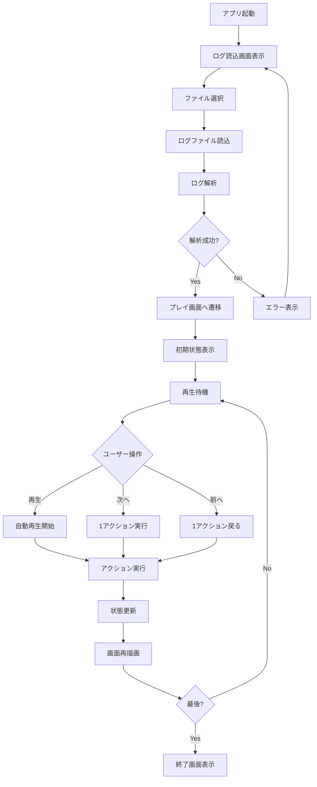
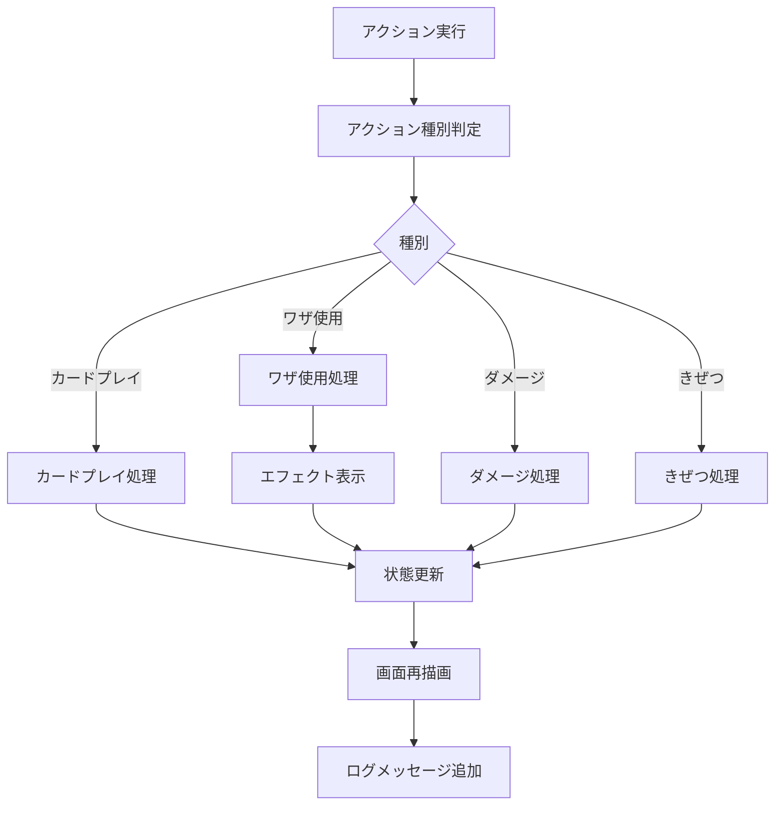

# PTCGLログリプレイアプリ 機能設計書

## 1. システム概要

### 1.1 目的
PTCGLのログファイルを読み込み、対戦内容を視覚的にリプレイ表示するアプリケーション

### 1.2 主要機能
1. ログファイル読込・解析機能
2. 対戦リプレイ表示機能
3. カード情報表示機能
4. 再生制御機能
5. エフェクト表示機能

## 2. 機能詳細

### 2.1 ログ読込解析機能

#### 2.1.1 ログファイル読込
**機能ID**: F-001  
**機能名**: ログファイル選択・読込

**概要**:
- ユーザーがローカルのログファイル（.txt形式）を選択
- ファイルを読み込んでメモリに展開

**入力**:
- ログファイル（.txt形式）

**処理**:
1. ファイル選択ダイアログを表示
2. ユーザーが選択したファイルを読み込み
3. ファイル内容をテキストとして取得
4. 解析処理へ渡す

**出力**:
- ログファイルの内容（テキストデータ）

**エラー処理**:
- ファイルが存在しない場合 → エラーメッセージ表示
- ファイル形式が不正な場合 → エラーメッセージ表示
- ファイル読込に失敗した場合 → エラーメッセージ表示

---

#### 2.1.2 ログ解析
**機能ID**: F-002  
**機能名**: ログファイル解析

**概要**:
- ログファイルの内容を解析し、ゲーム状態とアクションリストを生成

**入力**:
- ログファイルの内容（テキストデータ）

**処理**:
1. ログを行ごとに分割
2. Setup セクションを解析
   - プレイヤー名の抽出
   - コイントスの結果
   - 初期手札の情報
   - マリガンの有無
   - 初期配置（バトル場、ベンチ）
3. Turn セクションを解析
   - ターン番号の抽出
   - アクションの種類を識別
   - カード名、ポケモン名、ダメージなどの情報を抽出
4. アクションリストを時系列で構築
5. ゲーム状態オブジェクトを生成

**出力**:
- アクションリスト（時系列順）
- 初期ゲーム状態

**エラー処理**:
- ログ形式が不正な場合 → エラーメッセージ表示
- 必須情報が欠けている場合 → 警告を表示して継続
- 未知のパターンが出現した場合 → ログに記録して継続

**参照**:
- [`PTCGLログ解析.md`](file:///c:/repo/pokelog/doc/PTCGLログ解析.md)

---

#### 2.1.3 カード画像マッピング
**機能ID**: F-003  
**機能名**: カード名から画像URLへのマッピング

**概要**:
- ログに出現するカード名から、対応するカード画像URLを取得

**入力**:
- カード名（英語）

**処理**:
1. 事前に取得したカードデータベース（JSON）を読み込み
2. カード名をキーとした検索可能なマップを作成
3. ログに出現するカード名を検索
4. 対応する画像URLを取得

**出力**:
- カード画像URL

**エラー処理**:
- カードが見つからない場合 → デフォルト画像を使用
- 画像URLが無効な場合 → デフォルト画像を使用

**参照**:
- [`カード画像URL取得ガイド.md`](file:///c:/repo/pokelog/doc/カード画像URL取得ガイド.md)
- `data/pokemon_cards.json`

---

### 2.2 プレイ画面表示機能

#### 2.2.1 ゲーム状態の描画
**機能ID**: F-004  
**機能名**: ゲーム盤面の表示

**概要**:
- 現在のゲーム状態を画面に描画

**入力**:
- 現在のゲーム状態オブジェクト

**処理**:
1. バトル場のポケモンを表示
   - カード画像を配置
   - ダメカン表示
   - 特殊状態アイコン表示
   - エネルギー表示
   - 道具表示
2. ベンチのポケモンを表示（最大8匹、2列対応）
3. 手札を表示（自分のみカード画像、相手は裏面）
4. 山札を表示（裏面）
5. トラッシュを表示（枚数のみ）
6. サイドカードを表示（残数表示）
7. スタジアムカードを表示
8. ターン情報を表示

**出力**:
- 画面への描画

**参照**:
- [`リプレイアプリUI設計.md`](file:///c:/repo/pokelog/doc/リプレイアプリUI設計.md)

---

#### 2.2.2 ログメッセージ表示
**機能ID**: F-005  
**機能名**: アクションログの日本語表示

**概要**:
- 実行されたアクションを日本語で表示

**入力**:
- アクションオブジェクト

**処理**:
1. アクションの種類を判定
2. 日本語メッセージに変換
   - 例: `Player1 drew Nest Ball.` → `Player1 がネストボールを引きました。`
   - 例: `Player1 played Nest Ball.` → `Player1 がネストボールを使用しました。`
   - 例: `Player1's Rotom V used Instant Charge.` → `Player1 のロトムVが「インスタントチャージ」を使いました。`
3. ログエリアに追加表示

**出力**:
- ログエリアへの日本語メッセージ

**重要アクションの色分け**:
- 通常アクション: 黒
- ワザ使用: 青
- ポケモンきぜつ: 赤
- サイド取得: 金色
- ゲーム終了: 緑

---

### 2.3 カード情報表示機能

#### 2.3.1 カード拡大表示
**機能ID**: F-006  
**機能名**: カードクリック時の拡大表示

**概要**:
- ユーザーがカードをクリックすると、大きくポップアップで表示

**入力**:
- クリックされたカード情報

**処理**:
1. カードクリックイベントを検出
2. カード画像を取得
3. 画面中央にオーバーレイでポップアップ表示
4. カード外をクリックまたはESCキーで閉じる

**出力**:
- ポップアップウィンドウ

**表示内容**:
- カード画像（大サイズ）
- カード名
- HP
- ワザ
- 弱点・抵抗力・にげる

---

### 2.4 再生制御機能

#### 2.4.1 自動再生
**機能ID**: F-007  
**機能名**: 自動再生

**概要**:
- アクションを自動的に順次実行して、対戦をリプレイ

**入力**:
- 再生速度（0.5x 〜 3.0x）

**処理**:
1. 再生ボタンがクリックされる
2. 現在のアクションインデックスから開始
3. タイマーを設定（速度に応じた間隔）
4. 次のアクションを実行
5. ゲーム状態を更新
6. 画面を再描画
7. ログメッセージを追加
8. 次のアクションへ進む
9. 最後まで到達したら停止

**出力**:
- 画面更新
- アクション実行

**制御**:
- 一時停止ボタンで停止
- 速度スライダーで再生速度変更

---

#### 2.4.2 ステップ再生
**機能ID**: F-008  
**機能名**: ステップ再生（1アクションずつ再生）

**概要**:
- ユーザーが「次へ」ボタンをクリックするごとに、1アクションずつ実行

**入力**:
- ユーザーのボタンクリック

**処理**:
1. 「次へ」ボタンがクリックされる
2. 次のアクションを1つ実行
3. ゲーム状態を更新
4. 画面を再描画
5. ログメッセージを追加
6. アクションインデックスを+1

**出力**:
- 画面更新
- アクション実行

**同様の機能**:
- 「前へ」ボタン: 1アクション戻る
- 「最初へ」ボタン: ゲーム開始時に戻る
- 「最後へ」ボタン: ゲーム終了時へジャンプ

---

### 2.5 エフェクト表示機能

#### 2.5.1 ワザ使用時のエフェクト
**機能ID**: F-009  
**機能名**: ワザエフェクト表示

**概要**:
- ポケモンがワザを使用したときに、視覚的なエフェクトを表示

**入力**:
- ワザ情報（ワザ名、ダメージ、効果）

**処理**:
1. ワザ使用アクションを検出
2. エフェクトの種類を決定
   - 攻撃ワザ: ダメージエフェクト
   - 補助ワザ: 回復・強化エフェクト
   - 特殊効果: カスタムエフェクト
3. アニメーション再生
   - パーティクルエフェクト
   - フラッシュエフェクト
   - ダメージ数値の表示
4. 効果音再生（オプション）

**出力**:
- 画面上のエフェクト表示

**エフェクトの種類**:
- **攻撃ワザ**: 赤い光、爆発、衝撃波
- **サポートワザ**: 緑の光、回復エフェクト
- **特殊状態付与**: 該当する状態のアイコンが浮かぶ

---

## 3. データ構造

### 3.1 ゲーム状態オブジェクト

```typescript
interface GameState {
  players: {
    player1: PlayerState;
    player2: PlayerState;
  };
  activePlayer: "player1" | "player2";
  turnNumber: number;
  stadium: Card | null;
}

interface PlayerState {
  name: string;
  deck: number;  // 山札の残り枚数（推定）
  hand: Card[];  // 手札（自分のみ）
  handCount: number;  // 手札枚数（相手）
  prizeCount: number;  // サイド残数
  prizeCards: Card[];  // サイドカード（自分のみ）
  activePokemon: Pokemon | null;
  bench: Pokemon[];  // 最大8匹
  discardPile: Card[];
  lostZone: Card[];
  vstarUsed: boolean;
}

interface Pokemon {
  card: Card;
  hp: number;
  maxHp: number;
  damage: number;  // 受けているダメージ
  energies: Card[];  // 付いているエネルギー
  tools: Card[];  // 付いているポケモンのどうぐ
  specialConditions: SpecialCondition[];  // 特殊状態
  evolutionStage: number;  // 進化段階（0: たね, 1: 1進化, 2: 2進化）
}

interface Card {
  name: string;
  imageUrl: string;
  type: "pokemon" | "trainer" | "energy";
}

type SpecialCondition = "poisoned" | "burned" | "asleep" | "paralyzed" | "confused";
```

### 3.2 アクションオブジェクト

```typescript
interface Action {
  type: ActionType;
  player: string;
  timestamp: number;  // アクション番号
  data: any;  // アクション固有のデータ
}

type ActionType =
  | "draw"
  | "play_card"
  | "attach_energy"
  | "use_attack"
  | "evolve"
  | "retreat"
  | "knockout"
  | "take_prize"
  | "special_condition"
  | "heal"
  | "damage";
```

---

## 4. 処理フロー

### 4.1 アプリケーション起動からリプレイまで



### 4.2 アクション実行フロー



---

## 5. 非機能要件

### 5.1 性能要件
- ログ解析: 10,000行のログを5秒以内に解析
- 画面描画: 60FPS以上で滑らかな表示
- アクション実行: 100ms以内にレスポンス

### 5.2 互換性要件
- 対応ブラウザ: Chrome, Firefox, Safari, Edge（最新版）
- 対応OS: Windows, macOS, Linux
- 画面解像度: 1280x720 以上推奨

### 5.3 拡張性要件
- 新しいカード・ワザへの対応が容易
- エフェクトの追加・カスタマイズが可能
- ログフォーマットの変更に柔軟に対応

---

## 6. 制約事項

### 6.1 技術的制約
- カード画像はPokemon TCG APIから取得（インターネット接続必須）
- ログファイルは英語表記（日本語カード名は非対応）
- 山札の正確な枚数は追跡不可能（推定値のみ）

### 6.2 機能的制約
- 相手の手札内容は表示できない（ログに記録されていないため）
- 相手がどのサイドカードを取ったかは不明
- Setup画面（初期配置）は簡易表示のみ

---

## 7. 今後の拡張機能（オプション）

### 7.1 Phase 2機能
- ログの検索機能（特定のカード、プレイヤーで絞り込み）
- ブックマーク機能（重要なターンをマーク）
- 統計情報表示（使用カード、ダメージ総量など）

### 7.2 Phase 3機能
- 複数ログの比較再生
- ログのエクスポート（動画化）
- AIによる戦略分析

---

## 8. 参照ドキュメント

- [`PTCGLログ解析.md`](file:///c:/repo/pokelog/doc/PTCGLログ解析.md) - ログ解析の詳細
- [`リプレイアプリUI設計.md`](file:///c:/repo/pokelog/doc/リプレイアプリUI設計.md) - UI設計の詳細
- [`カード画像URL取得ガイド.md`](file:///c:/repo/pokelog/doc/カード画像URL取得ガイド.md) - カード画像取得方法
- [`ポケモンカードゲーム_ルール概要.md`](file:///c:/repo/pokelog/doc/rule/ポケモンカードゲーム_ルール概要.md) - ゲームルール

---

## 9. まとめ

この機能設計書に基づいて、PTCGLログリプレイアプリケーションを実装することで、ログファイルから対戦を完全に再現し、視覚的に楽しむことができます。

**重要な機能:**
1. ログ読込・解析機能
2. カード画像表示機能
3. 自動再生・ステップ再生機能
4. 日本語ログ表示機能
5. ワザエフェクト表示機能
