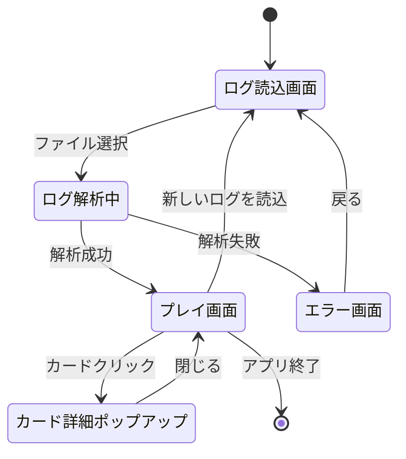
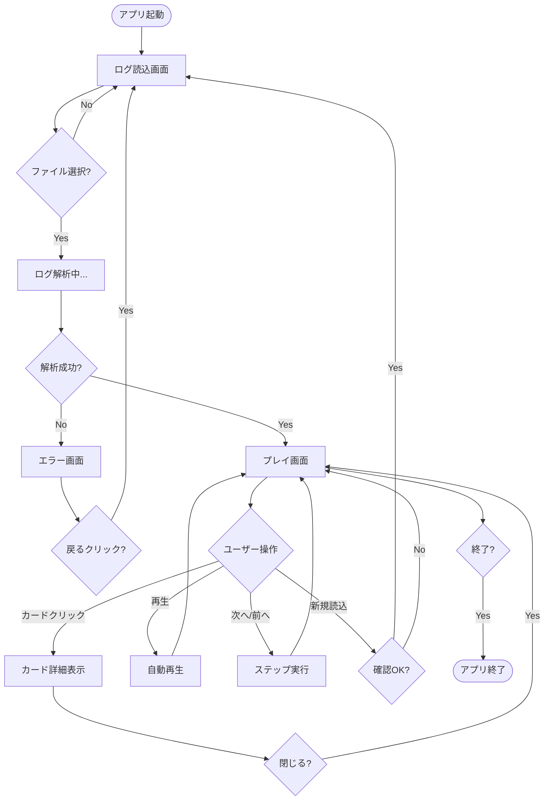
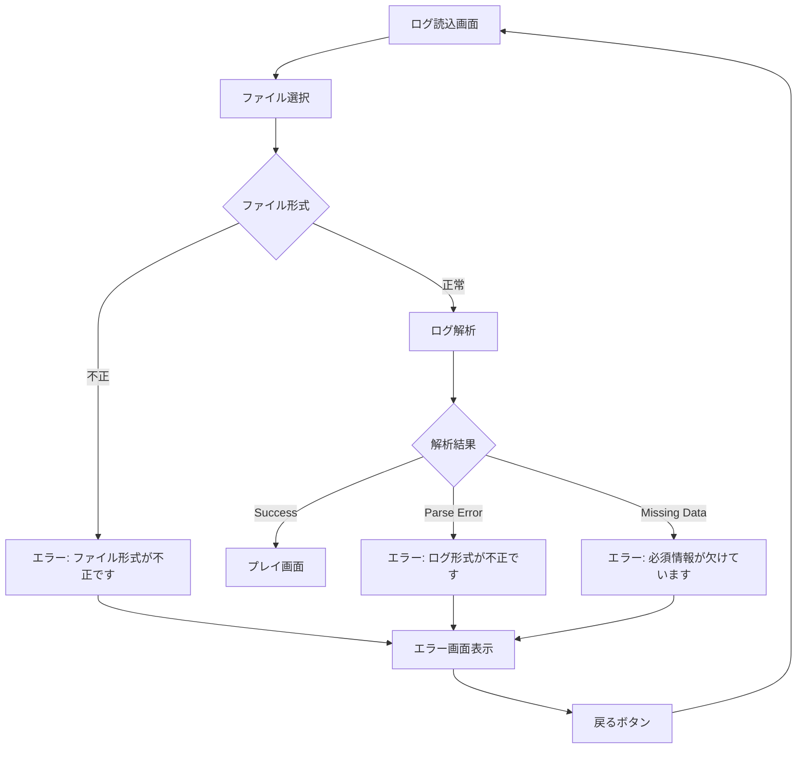

# PTCGLログリプレイアプリ 画面遷移図

## 1. 画面一覧

| 画面ID | 画面名 | 説明 |
|--------|--------|------|
| S-001 | ログ読込画面 | ログファイルを選択・読み込む画面 |
| S-002 | プレイ画面 | 対戦をリプレイ表示する画面 |
| S-003 | カード詳細ポップアップ | カードの詳細情報を表示 |
| S-004 | エラー画面 | エラーメッセージを表示 |

## 2. 画面遷移図



## 3. 詳細画面遷移

### 3.1 起動 → ログ読込

```
┌─────────────────┐
│  アプリ起動     │
└────────┬────────┘
         │
         ▼
┌─────────────────┐
│ ログ読込画面    │
│ [S-001]         │
│                 │
│ ┌─────────┐    │
│ │ファイル  │    │
│ │選択      │    │
│ └─────────┘    │
└────────┬────────┘
         │
         │ ファイル選択
         ▼
┌─────────────────┐
│ ログ解析中...   │
│ (ローディング)  │
└────────┬────────┘
         │
    ┌────┴────┐
    │         │
 成功 │         │ 失敗
    │         │
    ▼         ▼
┌───────┐  ┌───────┐
│プレイ │  │エラー │
│画面   │  │画面   │
│[S-002]│  │[S-004]│
└───────┘  └───┬───┘
               │
               │ 戻る
               ▼
         ┌─────────┐
         │ログ読込 │
         │画面     │
         └─────────┘
```

### 3.2 プレイ画面でのインタラクション

```
┌──────────────────────┐
│  プレイ画面 [S-002]  │
│                      │
│  ┌────────┐         │
│  │カード  │         │
│  │        │ ◄───┐   │
│  └───┬────┘     │   │
│      │          │   │
│      │ クリック │   │
│      ▼          │   │
│  ┌────────┐     │   │
│  │カード詳細│    │   │
│  │ポップアップ│  │   │
│  │[S-003]  │    │   │
│  └────┬───┘     │   │
│       │ 閉じる  │   │
│       └─────────┘   │
│                      │
│  ┌────────┐         │
│  │再生     │         │
│  │コントロール│       │
│  └────────┘         │
└──────────────────────┘
```

## 4. 画面遷移の詳細

### 4.1 ログ読込画面 → プレイ画面

**トリガー**: ユーザーがファイルを選択し、解析が成功

**条件**:
- ファイルが選択されている
- ファイル形式が正しい(.txt)
- ログ解析が成功

**処理**:
1. ファイル選択ダイアログを表示
2. ユーザーがファイルを選択
3. ローディング表示
4. ログファイルを読み込み
5. ログを解析
6. アクションリストとゲーム状態を生成
7. プレイ画面へ遷移
8. 初期状態を表示

**データ受け渡し**:
- アクションリスト
- 初期ゲーム状態
- プレイヤー名

---

### 4.2 ログ読込画面 → エラー画面

**トリガー**: ログ解析が失敗

**条件**:
- ファイル形式が不正
- ログ内容が不正
- 必須情報が欠けている

**処理**:
1. エラーを検出
2. エラー画面へ遷移
3. エラーメッセージを表示

**データ受け渡し**:
- エラーメッセージ
- エラーの種類

---

### 4.3 エラー画面 → ログ読込画面

**トリガー**: ユーザーが「戻る」ボタンをクリック

**処理**:
1.「戻る」ボタンクリック
2. ログ読込画面へ遷移

---

### 4.4 プレイ画面 → カード詳細ポップアップ

**トリガー**: ユーザーがカードをクリック

**条件**:
- クリック可能なカードが表示されている

**処理**:
1. カードクリックイベント検出
2. カード情報を取得
3. ポップアップを表示（オーバーレイ）
4. カード画像と詳細情報を表示

**データ受け渡し**:
- カード情報
- カード画像URL

---

### 4.5 カード詳細ポップアップ → プレイ画面

**トリガー**: ユーザーがポップアップ外をクリック、またはESCキー

**処理**:
1. 閉じるイベント検出
2. ポップアップを非表示
3. プレイ画面に戻る

---

### 4.6 プレイ画面 → ログ読込画面

**トリガー**: ユーザーが「新しいログを読込」ボタンをクリック

**処理**:
1. ボタンクリック
2. 確認ダイアログ表示（「現在の再生を終了しますか？」）
3. OKの場合、ログ読込画面へ遷移

---

## 5. 状態遷移表

| 現在の画面 | イベント | 条件 | 次の画面 | 備考 |
|-----------|---------|------|---------|------|
| ログ読込画面 | ファイル選択 | 解析成功 | プレイ画面 | アクションリストを渡す |
| ログ読込画面 | ファイル選択 | 解析失敗 | エラー画面 | エラーメッセージを表示 |
| エラー画面 | 戻るボタン | - | ログ読込画面 | - |
| プレイ画面 | カードクリック | - | カード詳細ポップアップ | モーダル表示 |
| カード詳細ポップアップ | 閉じる | - | プレイ画面 | - |
| プレイ画面 | 新規読込ボタン | 確認OK | ログ読込画面 | 確認ダイアログ表示 |
| プレイ画面 | 再生ボタン | - | プレイ画面 | 自動再生開始 |
| プレイ画面 | 一時停止ボタン | - | プレイ画面 | 自動再生停止 |
| プレイ画面 | 次へボタン | - | プレイ画面 | 1アクション進む |
| プレイ画面 | 前へボタン | - | プレイ画面 | 1アクション戻る |

---

## 6. ナビゲーション構造

```
アプリケーション
├── ログ読込画面 [S-001]
│   └── (ファイル選択ダイアログ)
│       ├── → プレイ画面 [S-002] (成功時)
│       └── → エラー画面 [S-004] (失敗時)
├── プレイ画面 [S-002]
│   ├── カード詳細ポップアップ [S-003]
│   │   └── → プレイ画面に戻る
│   └── → ログ読込画面 (新規読込)
└── エラー画面 [S-004]
    └── → ログ読込画面 (戻る)
```

---

## 7. 画面遷移のフローチャート

### 7.1 メインフロー



---

## 8. ユーザージャーニー

### 8.1 基本的な使用フロー

```
1. アプリを起動
   ↓
2. ログ読込画面でファイルを選択
   ↓
3. ログが自動解析される（ローディング表示）
   ↓
4. プレイ画面が表示される（初期状態）
   ↓
5. 「再生」ボタンをクリックして自動再生
   ↓
6. 対戦がリプレイされる
   ↓
7. 気になるカードをクリックして詳細確認
   ↓
8. ポップアップを閉じてリプレイ継続
   ↓
9. 最後まで再生されて終了
```

### 8.2 ステップ再生フロー

```
1. プレイ画面が表示される
   ↓
2. 「次へ」ボタンをクリック
   ↓
3. 1アクションずつ実行される
   ↓
4. ログメッセージを確認しながら進める
   ↓
5. 「前へ」で戻ることも可能
   ↓
6. 重要なターンをじっくり確認
```

---

## 9. エラーハンドリングと画面遷移

### 9.1 エラー発生時の遷移



---

## 10. まとめ

この画面遷移図は、PTCGLログリプレイアプリケーションの全ての画面とその遷移パターンを定義しています。

**主要な画面遷移:**
1. ログ読込画面 → プレイ画面（メインフロー）
2. プレイ画面 ⇔ カード詳細ポップアップ（インタラクション）
3. エラー画面 → ログ読込画面（エラー処理）

**特徴:**
- シンプルな2画面構成
- モーダルポップアップでカード詳細表示
- エラー時は明確なフィードバック
- 新規ログ読込で最初に戻れる
